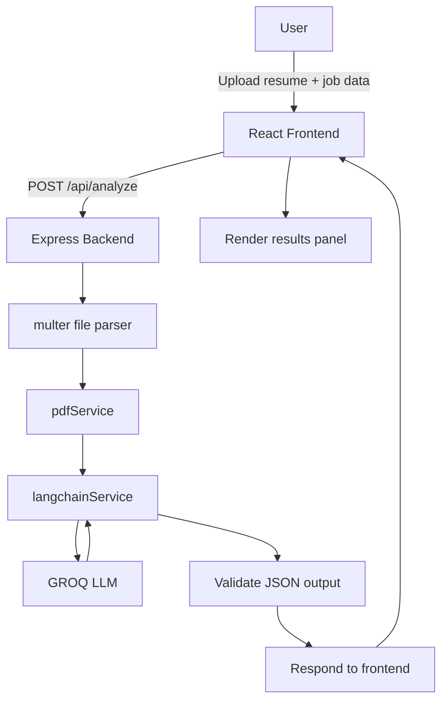
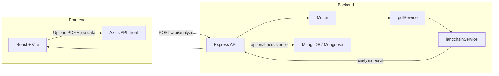

# Resume Analyzer Using AI. 

A resume analysis application that compares a PDF resume against a job description using AI. The frontend lets users upload their resume and paste the job description, while the backend extracts text, analyzes the resume with LangChain + GROQ, and returns a structured match report.


## Features

- Upload a PDF resume and analyze it against a job description
- Auto-extract text from PDF resumes using `pdf-parse`
- AI-powered resume evaluation via LangChain + GROQ
- Structured output with:
  - `matchScore`
  - `matchedSkills`
  - `missingSkills`
  - `improvements`
  - `finalSummary`
- Clean React frontend built with Vite
- REST API backend with Express
- CORS-enabled backend for local frontend integration
- Health check endpoint for server status

## Use Case

This app is designed for:

- Job seekers who want to understand how well their resume matches a target job
- Recruiters wanting a quick score and improvement recommendations
- Career coaches providing resume feedback
- Anyone who needs a fast, AI-driven resume comparison tool

## Technologies Used

- Frontend: React, Vite, Axios
- Backend: Node.js, Express, Multer, CORS, `pdf-parse`
- AI / LLM: LangChain, `@langchain/groq`, GROQ LLM model
- Data: MongoDB via Mongoose (connection configured in backend)
- Environment config: dotenv

## How to Use

### Backend

1. Open `resume-analyzer-be`
2. Create a `.env` file with:
   - `MONGODB_URI` for MongoDB connection
   - `GROQ_API_KEY` for the GROQ LLM
   - Optional: `PORT` and `FRONTEND_URL`
3. Install dependencies:
   ```bash
   cd resume-analyzer-be
   npm install
   ```
4. Start the backend:
   ```bash
   npm start
   ```

### Frontend

1. Open `resume-analyzer-fe`
2. Install dependencies:
   ```bash
   cd resume-analyzer-fe
   npm install
   ```
3. Start the frontend:
   ```bash
   npm run dev
   ```
4. Open the local Vite URL shown in the terminal

### Using the App

- Upload a PDF resume
- Enter the job title and job description
- Click `Analyze Resume`
- Review the AI-generated score, matched skills, missing skills, improvement suggestions, and summary

## How It Works

1. The frontend collects:
   - Resume PDF file
   - Job title
   - Job description
2. Frontend sends the file and text data to the backend via `/api/analyze`
3. Backend extracts text from the PDF using `pdf-parse`
4. Backend constructs a LangChain prompt and sends the resume + job description to GROQ
5. AI returns a JSON object with score and recommendations
6. Backend parses and validates the JSON response
7. The frontend displays the results in the UI

## System Design / Workflow

The system is split into a React frontend and an Express backend. The frontend collects the resume PDF and job details, then sends them to the backend. The backend extracts text, calls the AI model, validates the response, and returns structured analysis data.

### Workflow Diagram



### Architecture Diagram



### Detailed workflow

1. The user provides the resume PDF and job description in the frontend.
2. The frontend sends a `multipart/form-data` request to `/api/analyze` using Axios.
3. The backend route receives the request and `multer` extracts the uploaded file into memory.
4. The file buffer is passed to `pdfService`, which extracts plain text from the PDF.
5. `langchainService` receives resume text, job title, and job description, then builds a strict JSON prompt.
6. The GROQ model is invoked and returns a JSON response with score, matched skills, missing skills, improvements, and summary.
7. The backend validates the JSON structure and returns the parsed object to the frontend.
8. The frontend displays the analysis results in the results panel for the user.

## Folder Structure

### Frontend

`resume-analyzer-fe/`
- `src/`
  - `App.jsx`
  - `main.jsx`
  - `index.css`
  - `App.css`
  - `components/`
    - `ApiKeyInput.jsx`
    - `JobDescInput.jsx`
    - `UploadZone.jsx`
    - `ResultsPanel.jsx`
    - `ScoreCircle.jsx`
  - `pages/`
    - `Home.jsx`
  - `services/`
    - `api.js`
- `package.json`
- `vite.config.js`
- `eslint.config.js`

### Backend

`resume-analyzer-be/`
- `server.js`
- `src/`
  - `app.js`
  - `routes/`
    - `analyzeRoutes.js`
  - `controllers/`
    - `analyzeController.js`
  - `services/`
    - `pdfService.js`
    - `langchainService.js`
    - `dbService.js`
  - `middleware/`
    - `errorHandler.js`
  - `models/`
    - `Analysis.js`
  - `cron/`
- `package.json`

## Notes

- The backend currently includes stubbed history endpoints (`/api/analyze/history`, `/api/analyze/:id`) but returns empty arrays.
- The AI response is validated to ensure it contains exactly the expected JSON fields.
